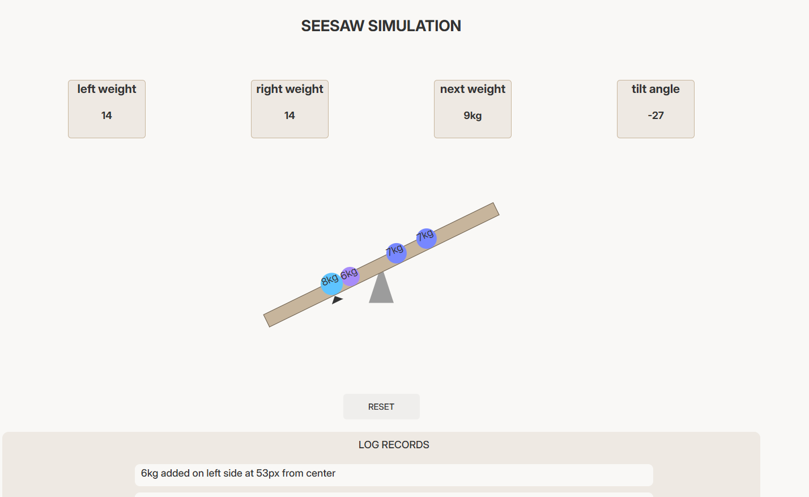

# Seesaw Simulation

This project is a mini web application where users can visually experience physics concepts such as torque, balance, and angle change by adding weights to a seesaw.
The application stores the positions of the weights and the angle using localStorage, ensuring the state is preserved even when the page is refreshed.

## Thought Process and Design Decisions

After completing the initial design, I first created the project structure using HTML. Then, I implemented the visual layout—such as positioning, shapes, and overall styling—using CSS.

For the logic layer, I began by creating a weight object and placing it on the seesaw plank. I made this interaction clickable so the user could add a weight to any point on the plank. Later, I extended this feature to support adding multiple weight objects.

Based on the click position relative to the plank’s center, I determined whether the weight was placed on the left or right side and stored these weights in separate arrays. Each weight object contains its mass, distance from the center, and the exact clicked position.

Using the left and right weight arrays, I calculated torque and rotation angle, then rotated the plank accordingly to simulate real balance physics. I also generated action logs and displayed them in the UI.

To keep the seesaw state persistent even after refreshing the page, I stored the angle, leftWeights array, and rightWeights array in localStorage.

Finally, I implemented the functionality for the reset button, added visual styles for the weight objects (including color and size mapping), and created animations for weight placement.

## Trade-off
Instead of storing logs in localStorage, I regenerated them on page reload using the createLog() function based on the current weights arrays. This reduces storage usage at the cost of re-rendering logs on load—a reasonable trade-off for this project size.

